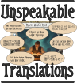

<p align="center">
   
</p>

# Unspeakable Translations

A local web workbench for capturing, translating, reviewing, and publishing fan-made
scenarios for **Arkham Horror: The Card Game**.

A project stores card images and captured source data once. Translations are stored
separately for each target language. The workbench supports structured data imports,
AI-assisted card recognition and translation, manual editing, field-level review
states, Shoggoth import/export, and Git-backed project publication.


## Quick start

Requirements: Python 3.12 or newer and [`uv`](https://docs.astral.sh/uv/).

```bash
uv sync
uv run unspeakable-translations serve
```

Open <http://127.0.0.1:8000>. 


## Overview


<p align="center">
   
</p>


## Workflow

1. On the dashboard, use **Create campaign** to store its name, author, source URL,
   and source language.
2. Use **Create scenario** to add one or more scenarios to the campaign, then copy
   source card images into the displayed
   `library/projects/ah/<campaign>/scenarios/<scenario>/source/cards/` directory.
3. Open **Capture source data**. The page explains the supported filename conventions,
   groups fronts and backs, and provides source-text and metadata fields for every card.
   Source data is stored in `base/extraction.json` without requiring a translation.
4. Use **Start translation** to select an existing scenario and a target language. This
   creates the language-specific files and opens the translation workbench.
5. Translate or import text, edit it manually, and resolve review markers. Additional
   target languages reuse the same source images and captured source data.
6. Generate a Shoggoth document when needed. Use **Publish translation** to copy the
   shared base, source files, and the selected language into the tracked `projects/`
   directory.

`library/` is the local, Git-ignored workspace. The application creates normal project
directories itself; manually preparing a scenario folder is not required.


## Project layout

```text
library/projects/ah/my-campaign/
├── campaign.json                   # Name, author, URL, and source language
└── scenarios/my-first-scenario/
    ├── project.json                # Scenario settings
    ├── source/
    │   ├── cards/                  # Source card images
    │   └── art/                    # Optional separate illustrations uploaded in the UI
    ├── base/
    │   ├── extraction.json         # Extraction manifest and card-file mappings
    │   └── cards/
    │       └── <card-key>.json     # Source text, metadata, and review state for one card
    ├── logs/                        # Translation or recognition operations
    │   └── translation.jsonl
    ├── snapshots/                  # Imported JSON source files
    └── translations/               # Optional; created when a translation starts
        └── de/
            ├── project.json        # Language settings and final-review state
            ├── translation.json    # Language-wide translation metadata
            ├── cards/
            │   └── <card-key>.json # Translated text and review state for one card
            └── builds/shoggoth.json
            └── renders/
                └── <card-key>.png  # Exported images from shoggoth
```

At read time, the workbench composes the card files referenced by
`base/extraction.json` with the selected language's sparse `cards/` directory. It
separates them again when saving. Source corrections therefore become visible to every
language without duplicating existing translations. Legacy base and translation
documents with an embedded `cards` array remain readable and are migrated to card files
on the next save.

When **Use separate card art** is enabled, a front or back illustration can be uploaded
through the workbench. The file is stored under `source/art/` and used by Shoggoth as
the illustration while the complete source card remains available for capture and
review.


## Translation and card recognition

### Local TranslateGemma

Local text translation uses `translategemma:12b-it-q8_0` through Ollama at
`http://127.0.0.1:11434` by default:

```bash
ollama pull translategemma:12b-it-q8_0
```

Ollama can be enabled or disabled under **Settings → AI and translation**. Configure
the model, context size, or server with:

```text
UNSPEAKABLE_TRANSLATIONS_TRANSLATEGEMMA_MODEL
UNSPEAKABLE_TRANSLATIONS_TRANSLATEGEMMA_CONTEXT_LENGTH
OLLAMA_HOST
```

### External providers

Optional keys are read from the local, Git-ignored `.env` file or the process
environment:

```dotenv
GOOGLE_CLOUD_TRANSLATION_API_KEY=...
GEMINI_API_KEY=...
OPENAI_API_KEY=...
ANTHROPIC_API_KEY=...
```

- Google Cloud enables server-side Google translation.
- **Google ↗** opens the active source field in Google Translate without requiring an
  API key. The copied result can be pasted back and checked against project rules.
- Gemini can translate text and perform structured card recognition.
- Gemini, OpenAI, and Anthropic can be selected for structured card recognition.

Override the default recognition models with `UNSPEAKABLE_TRANSLATIONS_GEMINI_MODEL`,
`UNSPEAKABLE_TRANSLATIONS_OPENAI_MODEL`, and
`UNSPEAKABLE_TRANSLATIONS_ANTHROPIC_MODEL`. The selected provider is saved in the
local `.env` file.

Game-wide and project-specific translation rules act as a glossary. Symbol tokens such
as `{action}` and glossary matches are protected during translation. If a provider
changes protected content, the workbench shows an editable review dialog instead of
silently accepting the result.

The workbench also provides region OCR: select a source field, draw a rectangle on the
card, review the recognized text, and apply it explicitly.

Use **Prepare LLM batch** above the card list to create one complete recognition and
translation job for every visible card side. The JSON jobs are written to
`llm-batch/<target-language>/` with the same stem as their source image; for example,
`location_library-front.png` produces `location_library-front.job.json`. Each job contains
the card-specific prompt, output schema, logical card, side, languages, original image path,
and a small set of locally selected official translation references. Shared instructions and
the glossary are stored once in `context.json`; `manifest.json` indexes all jobs. The full
ArkhamDB files are never sent to the LLM. Regenerating the batch refreshes generated job files
and excludes card sides marked hidden. After generation, the workbench shows the project path
and a short, copyable prompt for processing all jobs with Codex, OpenCode, or a similar agent.
The agent only produces result files. Choose **Apply batch results** in the workbench afterward;
the deterministic importer validates every result before atomically applying source text,
translation, and metadata through the same backend path as the per-card **Apply JSON** action.
The page reloads automatically after a successful import. The equivalent CLI command remains
available as `unspeakable-translations import-llm-batch` for scripted workflows.
Batch schemas keep titles, subtitles, traits, and metadata free of styling tags. Only rules and
flavor may use `<b>`, `<bi>`, `<i>`, or `<blockquote>`; the legacy numeric clue form `1<per>` is
accepted, while location connections remain structured canonical IDs.

## Structured data and Shoggoth

Arkham projects can import a Shoggoth project JSON. Rendered card images named
`<id>_<name>_front_0.png` and `<id>_<name>_back_0.png` are grouped and matched by the
full Shoggoth card ID. The importer falls back to the filename in `illustration` and
then to the card name. It retains card IDs, encounter sets, source illustration paths,
pan/scale values, location layouts, export profiles, and unknown Shoggoth fields for a
later export.

A Shoggoth JSON document contains image paths, not embedded image data. Copy the
rendered card PNGs into `source/cards/`. If the original illustration paths still
exist, the exporter reuses them with their imported positioning data; an illustration
uploaded through **Use separate card art** takes precedence.

## Publication, catalog, and releases

**Publish translation** copies the shared project file, source directory, base data,
and the currently opened language from `library/projects/` into the tracked
`projects/` directory. Other already-published languages are preserved. Publication
is blocked when the destination project contains uncommitted changes.


# Disclaimer:

Arkham Horror: The Card Game and The Lord of the Rings: The Card Game are trademarks of Fantasy Flight Publishing, Inc. / Fantasy Flight Games. This project is an unofficial, non-commercial fan creation and is not endorsed, sponsored, affiliated with, or approved by Fantasy Flight Games, Asmodee, or any of their respective affiliates. All card images, names, and trademarked game content remain the property of their respective copyright and trademark owners.
